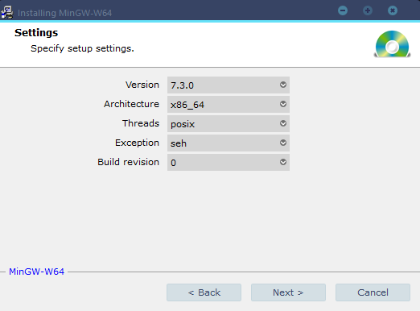

Build on Linux
--------------

Download and extract current version from http://www.llvm.org e.g. into $HOME/LLVM. Create 
two folders aside the source folder to hold the build and install files. Your folder
structure should look something like this

    llvm-8.0.0-build
    llvm-8.0.0-install
    llvm-8.0.0-src

Enter the build folder and type

    cmake -DCMAKE_BUILD_TYPE=Release -DCMAKE_INSTALL_PREFIX=$HOME/LLVM/llvm-8.0.0-install/ $HOME/LLVM/llvm-8.0.0-src/
    make -j8
    make install

Build on Windows(64Bit) using MinGW-w64
---------------------------------------

### Install MinGW-x64

Download the MinGW-w64 installer from this [URL](https://sourceforge.net/projects/mingw-w64/files/Toolchains%20targetting%20Win32/Personal%20Builds/mingw-builds/installer/mingw-w64-install.exe/download).
Then start the installer and set it up like this

### Compile LLVM

Download and extract current version from http://www.llvm.org e.g. into %HOME%\LLVM. Create two folders aside the source 
folder to hold the build and install files. Your folder structure should look something like this

    llvm-8.0.0-build
    llvm-8.0.0-install
    llvm-8.0.0-src

Start a command prompt with the PATH variable containing the MinGW-w64 binaries and enter the build folder and type

    cmake -DCMAKE_BUILD_TYPE=Release -DCMAKE_INSTALL_PREFIX=%HOME%\LLVM\llvm-8.0.0-install\ %HOME%\LLVM\llvm-8.0.0-src\ -G "MinGW Makefiles"
    mingw32-make -j8
    mingw32-make -j8 install

Now you should have a valid LLVM installation.

Build on Windows(64Bit) using Visual Studio 2017
------------------------------------------------

The compilation itself works but afterwards it was not possible to successfully link the JNI bindings against
this compilation's lib files.

Troubleshooting
---------------

Maybe you have to disable your anti virus software on Windows. E.g. Avira falsely reported a virus when running cmake.

When doing a debug build (CMAKE_BUILD_TYPE=Release=Debug) then during the linking stage LLVM needs lots of memory.
You will need 8GB of ram when running one build thread (=make -j1) and you will also need about 40GB(!) of disk
storage during compilation and installation of LLVM.

If compilation fails try it again without the "-j"-option.